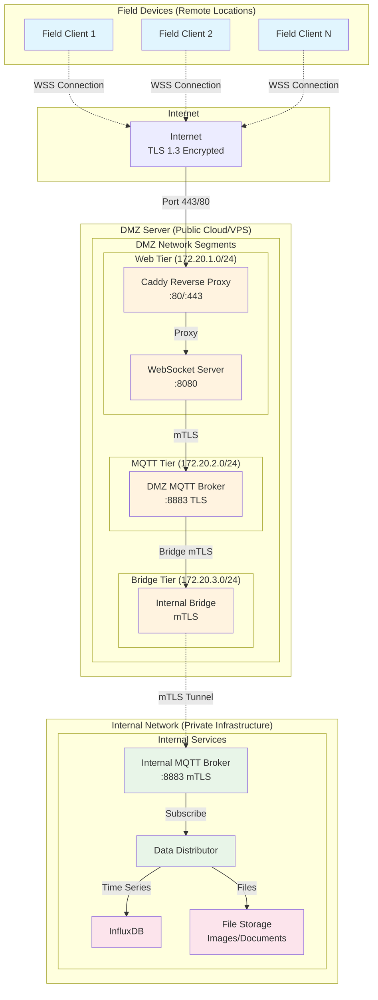
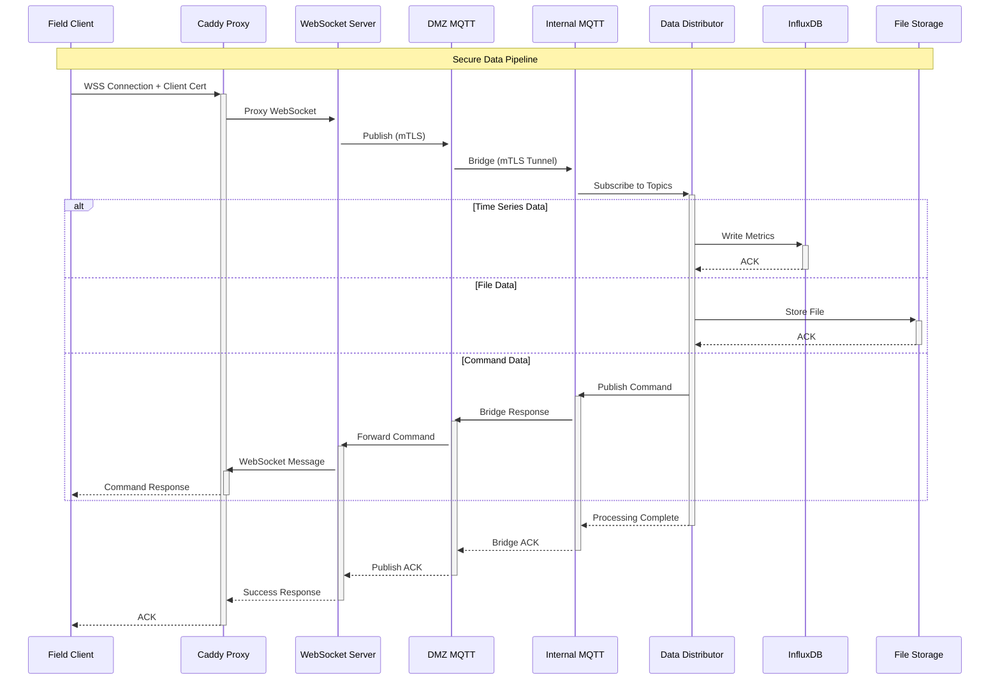

```mermaid
graph LR
    subgraph "Security Layers"
        subgraph "Network Security"
            FW[Firewall Rules]
            SEG[Micro-segmentation]
            VPN[VPN Tunnels]
        end
        
        subgraph "Transport Security" 
            TLS[TLS 1.3 Encryption]
            MTLS[Mutual TLS Auth]
            CERTS[Certificate Management]
        end
        
        subgraph "Application Security"
            AUTH[Device Authentication]
            VALID[Input Validation]
            RATE[Rate Limiting]
            ZT[Zero Trust Verification]
        end
    end
    
    FW --> SEG --> VPN
    TLS --> MTLS --> CERTS  
    AUTH --> VALID --> RATE --> ZT
    
    classDef security fill:#ffebee
    class FW,SEG,VPN,TLS,MTLS,CERTS,AUTH,VALID,RATE,ZT security
```

# FieldStream

**Secure Field-to-Corporate Data Streaming**

FieldStream is a production-ready, secure data streaming system designed for researchers and field devices. It safely bridges the gap between remote IoT sensors and corporate networks using WebSocket and MQTT protocols with Zero Trust security principles, end-to-end encryption, and automated certificate management.

## 🎯 Why FieldStream?

**For Researchers:**
- ✅ **15-minute setup** with pre-configured bundles
- ✅ **Works anywhere** - WiFi, cellular, or ethernet
- ✅ **Handles all data types** - sensors, images, events automatically
- ✅ **Built-in diagnostics** - know exactly what's happening
- ✅ **Offline resilience** - never lose data due to connectivity issues

**For IT Departments:**
- 🔒 **Enterprise security** - Zero Trust, mTLS, micro-segmentation
- 🏗️ **Corporate integration** - Direct to InfluxDB, existing infrastructure  
- 📈 **Scalable architecture** - Handles thousands of devices
- 🔧 **Easy management** - Automated certificates, device bundles
- 📊 **Full visibility** - Comprehensive monitoring and logging

## 🏗️ System Architecture

This system implements a three-tier security architecture designed for deployment across multiple machines:



### 🔒 Security Architecture



### 📊 Data Flow Architecture



## 🌐 Multi-Machine Deployment Architecture

This system is designed for deployment across **three separate machines**:

### Machine 1: Field Devices (Edge)
- **Location**: Remote field locations, industrial sites, IoT deployments
- **Components**: Field clients only
- **Network**: Outbound internet access required
- **Security**: Client certificates, device attestation

### Machine 2: DMZ Server (Public)
- **Location**: Public cloud (AWS, GCP, Azure) or VPS with public IP
- **Components**: Caddy, WebSocket Server, DMZ MQTT Broker
- **Network**: Public internet exposure (ports 80/443)
- **Security**: Let's Encrypt certificates, firewall rules, micro-segmentation

### Machine 3: Internal Network (Private)
- **Location**: Corporate network, private cloud, on-premises
- **Components**: Internal MQTT Broker, Data Distributor, InfluxDB integration
- **Network**: Private network, VPN/tunnel to DMZ
- **Security**: Internal certificates, network isolation

## 📋 Prerequisites

### All Machines
- Docker & Docker Compose
- OpenSSL (for certificate generation)

### DMZ Server
- Public IP address
- Domain name pointing to the server
- Ports 80/443 accessible from internet

### Internal Network
- InfluxDB instance
- Network connectivity to DMZ server (VPN/tunnel)
- File storage system for non-time-series data

## 🚀 Deployment Guide

### Step 1: Certificate Generation (Run Once)

**On any machine with this repository:**

```bash
# Clone repository
git clone https://github.com/tazomatalax/FieldStream
cd data-websocket

# Generate certificates for your domain
chmod +x scripts/generate-certificates.sh
./scripts/generate-certificates.sh your-dmz-domain.com

# This creates a 'certs/' directory with all required certificates
```

### Step 2: DMZ Server Deployment

**On your public DMZ server:**

```bash
# Transfer repository and certificates to DMZ server
scp -r data-websocket user@dmz-server:/opt/

# On DMZ server
cd /opt/data-websocket

# Configure environment
cp .env.example .env
nano .env
# Set DOMAIN_NAME=your-actual-domain.com
# Set ADMIN_EMAIL=your-email@domain.com

# Deploy DMZ services
cd dmz/
docker-compose up --build -d

# Verify deployment
docker-compose logs -f
```

### Step 3: Internal Network Deployment

**On your internal network server:**

```bash
# Transfer repository and certificates to internal server
scp -r data-websocket user@internal-server:/opt/

# On internal server
cd /opt/data-websocket

# Configure environment for internal network
cp .env.example .env.internal
nano .env.internal
# Configure InfluxDB settings (see configuration section below)

# Deploy internal services
cd internal-network/
docker-compose -f docker-compose.yml --env-file ../.env.internal up --build -d

# Verify deployment
docker-compose logs -f
```

### Step 4: Field Client Deployment

**On each field device:**

```bash
# Transfer client components and certificates
scp -r data-websocket/field-client user@field-device:/opt/
scp -r data-websocket/certs user@field-device:/opt/field-client/

# On field device
cd /opt/field-client

# Configure unique device ID
export DEVICE_ID="field-device-$(hostname)-$(date +%s)"
export DOMAIN_NAME="your-dmz-domain.com"

# Deploy field client
docker-compose up --build -d

# Verify connection
docker-compose logs -f
```

## ⚙️ Configuration

### InfluxDB Integration

**Environment Variables (.env.internal):**

```env
# InfluxDB Configuration (Version 2.x)
INFLUXDB_URL=http://your-influx-server:8086
INFLUXDB_TOKEN=your-influx-api-token
INFLUXDB_ORG=your-organization
INFLUXDB_BUCKET=sensor-data

# InfluxDB v1.x (if using legacy version)
INFLUXDB_URL=http://your-influx-server:8086
INFLUXDB_DATABASE=sensor_data
INFLUXDB_USERNAME=your-username
INFLUXDB_PASSWORD=your-password

# File Storage
FILE_STORAGE_PATH=/data/files
FILE_STORAGE_TYPE=local  # Options: local, s3, azure, gcs
```

### Supported Data Types

The system automatically handles all data types:

```javascript
// Time-series data (sent to InfluxDB)
{
  "deviceId": "sensor-001",
  "dataType": "timeseries",
  "payload": {
    "temperature": 23.5,
    "humidity": 65.2,
    "pressure": 1013.25,
    "timestamp": "2024-01-01T12:00:00Z"
  }
}

// File data (images, documents)
{
  "deviceId": "camera-001", 
  "dataType": "file",
  "payload": {
    "filename": "image_20240101_120000.jpg",
    "contentType": "image/jpeg",
    "data": "base64-encoded-content",
    "metadata": {
      "size": 1024000,
      "timestamp": "2024-01-01T12:00:00Z"
    }
  }
}

// Event data
{
  "deviceId": "alarm-001",
  "dataType": "event", 
  "payload": {
    "eventType": "alarm",
    "severity": "high",
    "message": "Temperature threshold exceeded",
    "timestamp": "2024-01-01T12:00:00Z"
  }
}

// Command responses
{
  "deviceId": "actuator-001",
  "dataType": "response",
  "payload": {
    "commandId": "cmd-12345",
    "status": "completed",
    "result": "valve opened",
    "timestamp": "2024-01-01T12:00:00Z"
  }
}
```

## 🛠️ Operations

### Monitoring

```bash
# Check DMZ services
docker-compose -f dmz/docker-compose.yml logs -f

# Check internal services  
docker-compose -f internal-network/docker-compose.yml logs -f

# Check field clients
docker-compose -f field-client/docker-compose.yml logs -f
```

### Scaling

**Adding new field devices:**
```bash
# Generate new client certificate
./scripts/generate-client-cert.sh new-device-id

# Deploy to new device with unique DEVICE_ID
```

**Adding DMZ capacity:**
```bash
# Scale WebSocket servers
docker-compose -f dmz/docker-compose.yml up --scale websocket-server=3
```

## 🔧 Network Security

### Firewall Configuration

**DMZ Server iptables rules:**
```bash
# Run the firewall setup script
sudo ./scripts/setup-firewall.sh
```

**Internal Network:**
```bash
# Allow only DMZ bridge connection
iptables -A INPUT -s DMZ_SERVER_IP -p tcp --dport 18883 -j ACCEPT
iptables -A INPUT -p tcp --dport 18883 -j DROP
```

## 📊 Data Pipeline Performance

- **Throughput**: 10,000+ messages/second per WebSocket server
- **Latency**: <100ms end-to-end (field device to InfluxDB)
- **Reliability**: 99.9% message delivery with MQTT QoS 1
- **Scalability**: Horizontal scaling of all components

## 🆘 Troubleshooting

### Common Issues

**Connection refused from field device:**
- Verify domain name resolution
- Check DMZ server firewall (ports 80/443)
- Validate client certificates

**MQTT bridge not connecting:**
- Check network connectivity between DMZ and internal
- Verify certificate permissions
- Review MQTT broker logs

**Data not reaching InfluxDB:**
- Check InfluxDB credentials in .env.internal
- Verify data distributor logs
- Test InfluxDB connectivity

### Debug Commands

```bash
# Test WebSocket connection
wscat -c wss://your-domain.com/ws

# Test MQTT connectivity  
mosquitto_pub -h dmz-server -p 8883 --cafile certs/ca.crt --cert certs/client.crt --key certs/client.key -t test -m "hello"

# Check certificate validity
openssl x509 -in certs/client.crt -text -noout
```